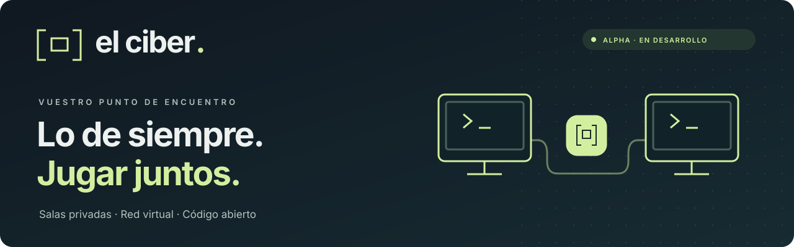
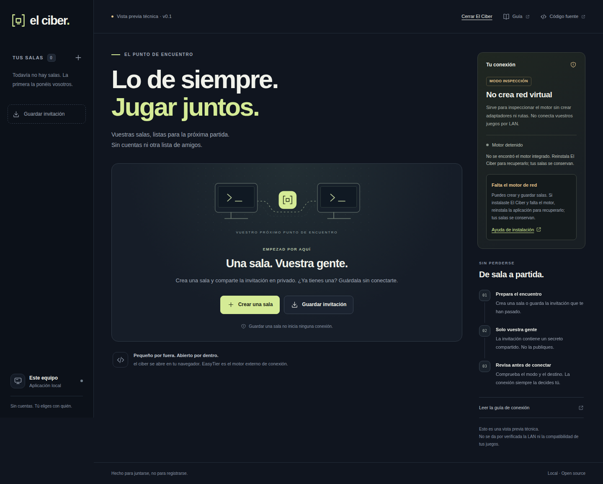
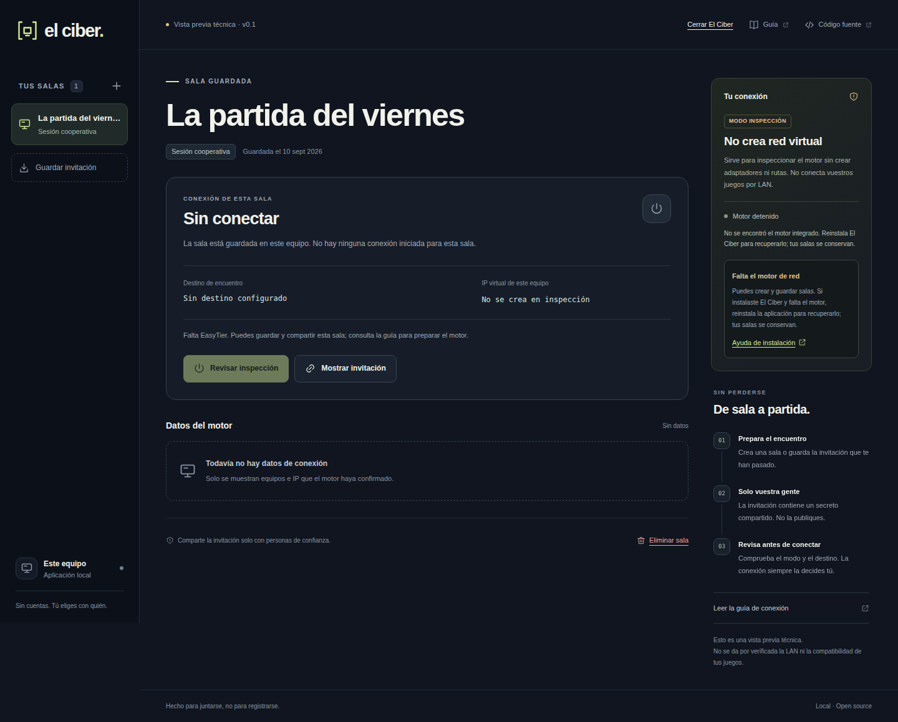
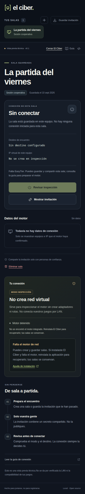

<p align="center">
  
</p>

<p align="center">
  <a href="LICENSE"></a>
  
  <a href="docs/ci/README.md"></a>
</p>

<p align="center"><strong>Una alternativa abierta a la experiencia de Hamachi, pensada para quedar con tus amigos y jugar en LAN.</strong><br>Sin cuentas obligatorias, sin Electron y sin reinventar el motor de red.</p>

<p align="center"><a href="#qué-es-el-ciber">Qué es</a> · <a href="#verlo-en-funcionamiento">Capturas</a> · <a href="#empezar">Empezar</a> · <a href="#estado-real-del-proyecto">Estado real</a> · <a href="PROJECT_STATUS.md">Estado y reanudación</a> · <a href="ROADMAP.md">Hoja de ruta</a> · <a href="CONTRIBUTING.md">Contribuir</a></p>

> [!IMPORTANT]
> **Primera versión técnica, no un sustituto terminado de Hamachi.** Ya puedes crear salas, intercambiar invitaciones y controlar un motor EasyTier instalado. El arranque predeterminado es de **inspección: no crea una LAN virtual y no sirve para jugar**. Las partidas entre PC Windows en redes distintas, la compatibilidad por juego y la estabilidad prolongada siguen pendientes de validación.

> **Para retomar el desarrollo:** [estado actual, decisiones y siguiente trabajo](PROJECT_STATUS.md). Este documento permite continuar desde el repositorio sin depender de un chat.

## Qué es El Ciber

Antes quedabais en el ciber. Ahora cada uno está en su casa. La idea es recuperar lo sencillo: una sala, vuestra gente y una partida.

**El Ciber** es un cliente local que organiza redes virtuales en salas privadas. La interfaz, la gestión de salas y el control del motor son propios. El transporte lo realiza [EasyTier](https://github.com/EasyTier/EasyTier), un proyecto abierto especializado en redes entre pares.

- **Salas que se quedan contigo.** Crea y guarda varios grupos sin abrir conexiones automáticamente.
- **Invitaciones directas.** Comparte el acceso por vuestro canal privado habitual, sin otra cuenta ni lista de amigos.
- **Control visible.** Revisa destino y modo antes de conectar. Desconecta desde el mismo panel.
- **Un cliente pequeño por diseño.** Go con biblioteca estándar, interfaz embebida y navegador del sistema. Node.js solo se usa para pruebas de desarrollo.
- **Sin llamadas de la interfaz a terceros.** Sin analítica, fuentes remotas ni CDN. Los enlaces externos solo se abren cuando los eliges.
- **Código abierto desde el principio.** Licencia MIT para el cliente y reconocimiento explícito de las licencias de terceros.

**Ligereza y estabilidad son objetivos de producto, no métricas publicitarias.** No prometemos latencias, consumo de RAM ni compatibilidad que no hayamos medido.

## Verlo en funcionamiento

Capturas de la aplicación real, ejecutada localmente con salas de prueba. No son renders de una interfaz futura. Muestran la alpha en modo inspección, sin una partida ni usuarios conectados simulados.

### El punto de encuentro



### Cada sala, con su conexión a la vista



<details>
<summary><strong>Vista compacta</strong> — adaptación de la interfaz, no una app VPN para móviles</summary>
<br>

</details>

## La experiencia que queremos entregar

**Instalar → crear una sala o aceptar una invitación → jugar.** Gratis y open source, sin alquilar servidores. Un solo instalador prepara el motor y el cliente; nadie debería instalar EasyTier por separado ni introducir nodos, IPs o claves técnicas.

**Conexión directa P2P primero; relay comunitario gratuito como respaldo.** El encuentro ayuda a descubrir pares; si se establece una conexión directa, el tráfico de juego circula entre amigos, no por ese servicio. Esta automatización todavía no está integrada. No se garantiza conexión directa en todas las redes ni disponibilidad o latencia de los nodos comunitarios.

La preparación manual que aparece más abajo es exclusivamente para desarrollar y validar esta alpha. **No es la experiencia final ni cumple todavía el criterio de instalar y usar.**

## Cómo encaja todo

```text
1. Crea una sala            2. Comparte en privado       3. Conectad y abrid el juego
   Nombre y destino   →       Tus amigos la guardan  →    IP virtual / LAN compatible
```

En esta alpha hay una preparación técnica previa: EasyTier instalado y un **nodo de encuentro compatible, alcanzable y con su clave pública verificada**. El proyecto no opera un nodo público ni configura uno automáticamente. Guardar una sala puede hacerse sin todo ello; jugar no.

Una sala no es un servidor de juego. Alguien sigue teniendo que crear la partida dentro del juego. Algunos títulos admiten una IP manual; otros dependen de broadcast o protocolos que una red IP virtual no reproduce por completo. En esta alpha solo se conecta al nodo explícito; la búsqueda P2P automática y el hole punching todavía están desactivados.

## Empezar

### 1 · Compilar y abrir la interfaz

Requisitos de desarrollo: **Go 1.27.1** o compatible y Git. Windows 11 x64 es el objetivo principal; Linux x64 es el entorno de validación local inicial.

```bash
git clone https://github.com/VaroTv7/elciber.git
cd elciber
go test ./...
```

**Windows · PowerShell**

```powershell
go build -trimpath -o dist/elciber.exe .
.\dist\elciber.exe
```

**Linux**

```bash
go build -trimpath -o dist/elciber .
./dist/elciber
```

Se abre el navegador en `http://127.0.0.1:37963`. No se conecta a ninguna sala ni se inicia el motor al arrancar. Con `--no-browser` puedes abrir esa dirección manualmente. Mantén el proceso abierto mientras utilices la interfaz; cerrar la pestaña no detiene el cliente.

Hay un [candidato de instalador único](docs/INSTALLER.md) compilado, pero todavía no validado en Windows ni listo para jugar: falta el servicio de encuentro automático. No hay instalador ni binarios firmados publicados todavía. El navegador del sistema participa en el consumo total: «sin Electron» no significa «sin coste de navegador».

### 2 · Preparar el motor, sin tocar la red

La integración se fija en **EasyTier 2.6.4**. Los descargadores opcionales consultan GitHub, comprueban el SHA-256 del paquete y extraen solo los archivos necesarios. **No ejecutan el motor ni instalan servicios/controladores.** No sobrescriben instalaciones existentes.

```powershell
# Windows, sin administrador
.\scripts\fetch-engine.ps1
.\dist\elciber.exe --engine-dir .\engines\easytier
```

```bash
# Linux, con Python 3.9+
python3 scripts/fetch_engine.py
./dist/elciber --engine-dir ./engines/easytier
```

También puedes descargarlo desde la [release oficial](https://github.com/EasyTier/EasyTier/releases/tag/v2.6.4) e indicar su carpeta con `--engine-dir`. No eludas políticas de ejecución de PowerShell para usar el script: revisa sus requisitos o utiliza la descarga oficial.

### 3 · Pasar de inspección a una VPN real

Lee primero la [guía de conexión y límites](docs/CONNECTING.md). El modo VPN se activa únicamente iniciando con `--enable-vpn`; puede necesitar permisos de administrador y un adaptador virtual. El binario de desarrollo sin empaquetar no se eleva por sí mismo. El [candidato de instalador](docs/INSTALLER.md) y su cliente gráfico sí solicitan UAC; todavía no existe un helper privilegiado separado. No se instala un servicio, abre el firewall ni modifica el router por ti.

No desactives el firewall. No habilites VPN en un servidor de producción para probar la interfaz. Elige un PC de pruebas, un nodo de confianza y una sala nueva. La primera partida Windows entre redes distintas sigue siendo un criterio pendiente, no un paso ya certificado.

## Estado real del proyecto

**Disponible en el código**

- Creación, guardado, importación y eliminación local de salas.
- Invitaciones versionadas con acceso compartido; guardar no conecta.
- API local con sesión efímera, controles de origen y entradas acotadas.
- Control de EasyTier externo: inicio explícito, consulta de estado y desconexión.
- Perfiles de inspección y VPN separados; modo seguro y clave del nodo exigida para VPN.
- Candidato de instalador web Windows con descarga automática y cierre gráfico, compilado pero pendiente de instalación real.
- Interfaz responsive con estados vacíos, errores y formularios que sobreviven al refresco.

**No se presenta como terminado**

- Instalador validado y experiencia «instalar → invitar → jugar» para personas no técnicas.
- Encuentro comunitario gratuito, conexión P2P preferente y relay de respaldo integrados automáticamente.
- Playtest Windows 11 entre redes distintas, TUN y tráfico de juego real.
- Descubrimiento LAN automático, compatibilidad universal o capa Ethernet completa.
- Invitaciones temporales, roles, expulsión individual y rotación de secretos.
- Recuperación tras crash/suspensión, conflictos de subred y pruebas prolongadas.
- Helper privilegiado separado, auditoría externa y mediciones comparables de rendimiento.

La evidencia local y su alcance exacto se conservan en [VALIDATION.md](docs/VALIDATION.md). La [automatización de pruebas](docs/ci/README.md) se conserva como plantilla sin activar; no se presenta como CI aprobada en GitHub. Las prioridades siguientes están en la [hoja de ruta](ROADMAP.md).

## Seguridad y privacidad

Una invitación contiene un secreto: **no es de un solo uso, no caduca y no debes publicarla**. Borrar la sala de tu equipo no revoca las copias de otras personas. Invita solo a gente de confianza: una VPN puede dar acceso a servicios del equipo según su firewall, no únicamente a tu juego.

El servicio local no debe exponerse en Internet. Los datos de sala se guardan localmente, sin cifrado de almacenamiento propio; la protección del perfil y del disco sigue siendo importante. El nodo de encuentro puede observar metadatos. No somos una VPN de anonimato.

Consulta [SECURITY.md](SECURITY.md), el [modelo de amenazas](docs/THREAT-MODEL.md) y los [avisos de terceros](THIRD_PARTY_NOTICES.md).

## Desarrollo

```bash
go test -race ./...
go vet ./...
go build -trimpath -o dist/elciber .
npm ci
npx playwright install chromium
npm test
python3 scripts/fetch_engine.py  # solo si aún no está descargado
python3 scripts/smoke_engine.py # Linux: motor real en loopback, SIN TUN
```

La interfaz no necesita `npm install` para funcionar. Playwright se utiliza para comprobar el navegador real y regenerar capturas. La prueba del motor no demuestra una VPN funcional entre dos máquinas ni una partida.

- [Arquitectura](docs/ARCHITECTURE.md)
- [Contrato de API](docs/API.md)
- [Contribuir](CONTRIBUTING.md)
- [Registrar una prueba con un juego](https://github.com/VaroTv7/elciber/issues/new/choose)
- [Historial de cambios](CHANGELOG.md)

## Licencia y créditos

Cliente y recursos propios bajo [MIT](LICENSE). Motor EasyTier externo bajo su licencia LGPL-3.0; no se incluyen sus binarios ni controladores en este repositorio. Véanse los [avisos completos](THIRD_PARTY_NOTICES.md).

Creado por **VaroTv7**. Ingeniería inicial: **OTACON Astra**. Proyecto independiente, sin afiliación con Hamachi ni EasyTier.

---

**English:** El Ciber is an open-source, local-first room manager for playing LAN games with friends, built around the external EasyTier networking engine. This is an early technical alpha, not a finished Hamachi replacement. The default inspection mode does not create a virtual network. A Windows web installer has been built but not run on Windows. Free community-assisted discovery, P2P-first connectivity with relay fallback, real cross-network gaming and game compatibility validation are still pending. See [project status](PROJECT_STATUS.md) to resume development.
